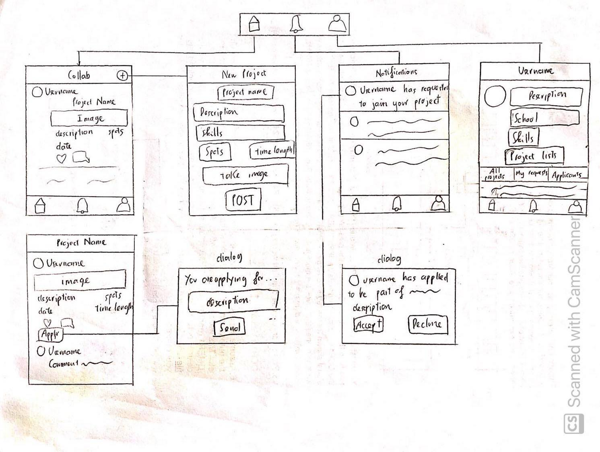

# Collab

## Table of Contents
1. [Overview](#Overview)
1. [Product Spec](#Product-Spec)
1. [Wireframes](#Wireframes)
2. [Schema](#Schema)

## Overview
### Description
Collab is a friendly mobile app that matches CS students and helps them to work on a project together based on their interests.

### App Evaluation
[Evaluation of your app across the following attributes]
- **Category:** Education and Social
- **Mobile:** only available on Android
- **Story:** allows user to view and apply to projects
- **Market:** students who are interested in collaborating and working on CS projects with other students
- **Habit:** Users can view the projects throughout the day and apply if they are interested
- **Scope:** Collab is very narrow-focused, main targets college students who want to improve their CS knowledge and work on side projects

## Product Spec    

### Requirements

| Requirement      | Details |
   | ------------- | -------- |
   | App has multiple views | (see screen archetypes below)
   | App interacts with a database (e.g. Parse) | Use Parse to store users, projects, comments, likes, requests, notifications
   | User can log in/log out of the app | User can log in/log out of the app
   | Use of camera | User can take a picture or select a picture from the gallery for the project image
   | App integrates with SDK | Google Login SDK, Github SDK
   | App uses complex algorithm | Project ranking (sort, display projects based on likes, skills)
   | App uses gesture recognizers | double-tap to like
   | App uses animations | transitions between fragments and activities
   | App uses an external library to add visual polish | Use Material Design to improve the UI and Glide for image loading

### 1. User Stories (Required and Optional)

**Required Must-have Stories**

- User can log in, log out and create a new user profile
- User can see a list of projects in the main activity
- User can click on the project to see more details
    - User can like or comment on the project
- User can add a new project
    - User can take pictures or attach pictures from gallery
- User can send a request to be part of the project
- Have an activity to display all the notifications
- Have a profile activity that displays all the information of that user
- User can click on the user's image or username to see the profile
- User can see all of their projects
- User can request to join a project
- Project owner can accept or decline a request

**Optional Nice-to-have Stories**
- Users can view their past requests
- Users can see all the applicants that applied to their projects
- Add more animations when switching views
- Allows users to edit profile
- Allows anonymous user to view the projects
- Integrate Github SDK

### 2. Screen Archetypes

* LoginActivity
   * User can log in or sign up
* MainActivity
    * Include HomeFragment, NotificationsFragment and MyProfileFragment
* HomeFragment
   * User can see all the projects sorted by the algorithm
   * Click on the project to see more details
   * Have an add button on the toolbar to add a new project
* NotificationsFragment
    * List all notifications
* MyProfileFragment
    * Shows profile, my projects, my requests, applicants
* NewProjectActivity
    * Allows user to fill in all information and post a new project
* ProjectDetailsActivity
    * Lists the description, skills, spots, time length
* ApplyDialog
    * Allows user to enter description and apply for the project
* ProcessRequestDialog
    * Accept or decline a request
* AboutFragment
	* Show user's info
* AllProjectsFragment
    * Shows all projects of a particular user
* PartOfFragment
	* Show all projects that the user is part of
* EditProfileActivity
    * Allow authenticated user to edit the profile
* MyRequestsActivity
    * Show all requests that the user has made
* ApplicantsFragment
    * Show all applicants that have applied to user's projects

### 3. Navigation

**Tab Navigation** (Tab to Screen)

* HomeFragment
* NotificationsFragment
* ProfileFragment

**Flow Navigation** (Screen to Screen)

* HomeFragment -> ProjectDetailsActivity -> ApplyDialog
* HomeFragment -> NewProjectActivity
* HomeFragment -> UserProfileActivity
* NotificationsFragment -> CheckRequestDialog
* MyProfileFragment -> AboutFragment
* MyProfileFragment -> AllProjectsFragment
* MyProfileFragment -> PartOfFragment
* MyProfileFragment -> EditProfileActivity
* MyProfileFragment -> MyRequestsActivity (optional)
* MyProfileFragment -> ApplicantsActivity (optional)

## Wireframes


### [BONUS] Digital Wireframes & Mockups

### [BONUS] Interactive Prototype

## Schema 

### Models

#### User

   | Property      | Type     | Description |
   | ------------- | -------- | ------------|
   | objectId      | String   | unique id for the user (default field) |
   | googleId      | String    | googleId from Google Auth SDK
   | username        | String | username |
   | password         | Hash by Parse     | user's password |
   | fullName | String | user's full name
   | description       | String   | user's description |
   | school | String   | school name |
   | skills    | Array of string   | list of all skills that the user has |
   | githubUsername | String | Github Username
   | githubToken | String | Github Token for API calls
   | createdAt     | DateTime | date when user is created (default field) |
   | updatedAt     | DateTime | date when user is last updated (default field) |
   
#### Project

| Property      | Type     | Description |
   | ------------- | -------- | ------------|
   | objectId      | String   | unique id for the project (default field) |
   | projectName        | String | project's name |
   | description       | String   | user's description |
   | skills | Array of String   | list of skills that are required for the project |
   | capacity  | Number | Capacity of the project
   | spots | Number | Number of taken spots
   | duration | String | Estimate time length of the project
   | image | ParseFile | image of the project
   | status | String | status of the project
   | owner | Pointer to User | pointer to the owner of the project
   | createdAt     | DateTime | date when project is created (default field) |
   | updatedAt     | DateTime | date when project is last updated (default field) |
   
#### Notification

| Property      | Type     | Description |
   | ------------- | -------- | ------------|
   | objectId      | String   | unique id for the project (default field) |
   | deliverTo | Pointer to User | pointer to the user that receives the notification
   | request | Pointer to Request | pointer to the request
   | type | Number | Type of notification (request, confirmation)
   | createdAt     | DateTime | date when notification is created (default field) |
   
#### Request

| Property      | Type     | Description |
   | ------------- | -------- | ------------|
   | objectId      | String   | unique id for the project (default field) |
   | requestedUser | ParseUser | pointer to the user that makes the request
   | project | Project | pointer to the project
   | status | String | Status of the project
   | description | String | user's description
   | createdAt     | DateTime | date when request is created (default field) |

#### Like

| Property      | Type     | Description |
   | ------------- | -------- | ------------|
   | objectId      | String   | unique id for the project (default field) |
   | owner | Pointer to User | pointer to the user that liked the project
   | project | Pointer to Project | pointer to the project
   | createdAt     | DateTime | date when request is created (default field) |
   
#### Comment

| Property      | Type     | Description |
   | ------------- | -------- | ------------|
   | objectId      | String   | unique id for the project (default field) |
   | owner | Pointer to User | pointer to the user that commented
   | project | Pointer to Project | pointer to the project
   | comment | String | comment's content
   | createdAt     | DateTime | date when request is created (default field) |

### Networking
- HomeFragment
    - (Read/GET) Query all projects
         ``` java
         ParseQuery query = ParseQuery.getQuery(Project.class);
         query.include(Project.KEY_OWNER);
         query.addDescendingOrder(Project.KEY_CREATED_AT);
         query.findInBackGround(new FindCallBack<Project>() {
             @Override
             public void done(final List<Project> projects, ParseException e) {
                 if (e != null) {
                     Log.e(TAG, "Issues with getting projects", e);
                     return;
                 }
                 // Process data
             }
         });
        ```
    - (READ/GET) Load number of likes for project
    - (READ/GET) Check whether the user has liked the project

- NotificationsFragment
    - (Read/GET) Get all notifications for current user
- MyProfileFragment
    - (Read/GET) Query projects that belong to current user
- NewProjectActivity
    - (Create/POST) Post new project
- ApplyDialog
    - (Create/POST) Post new request and notification
- ProcessRequestDialog
    - (Update/PUT) Update the status of request
